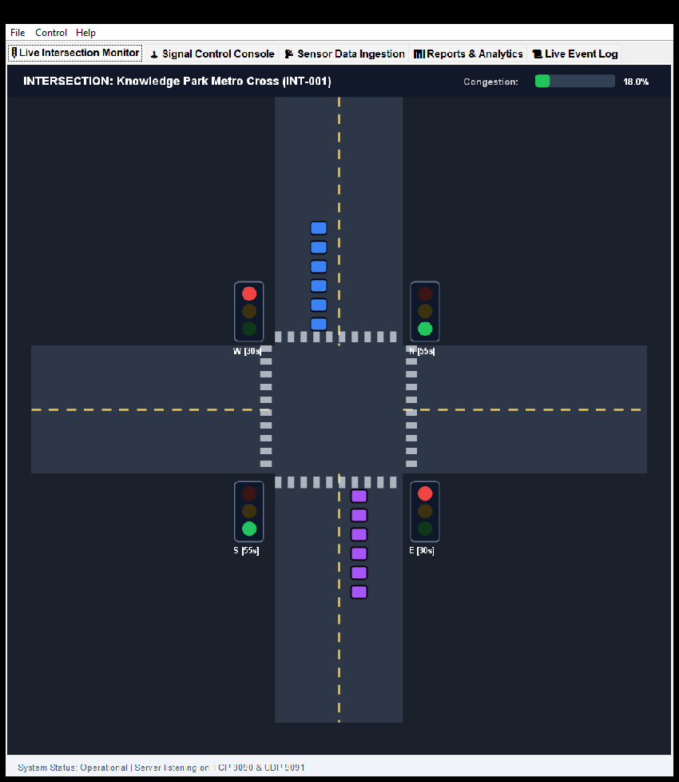
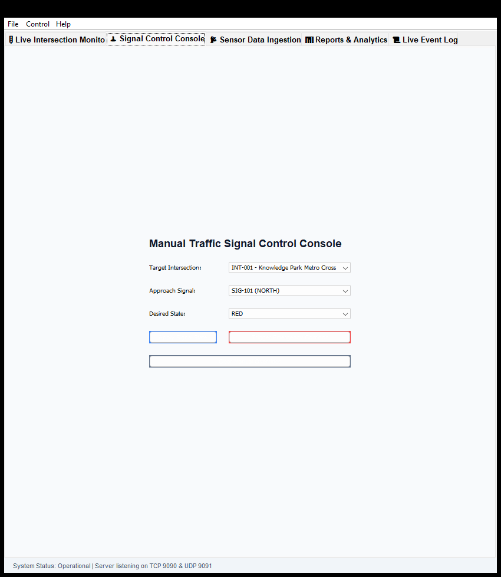
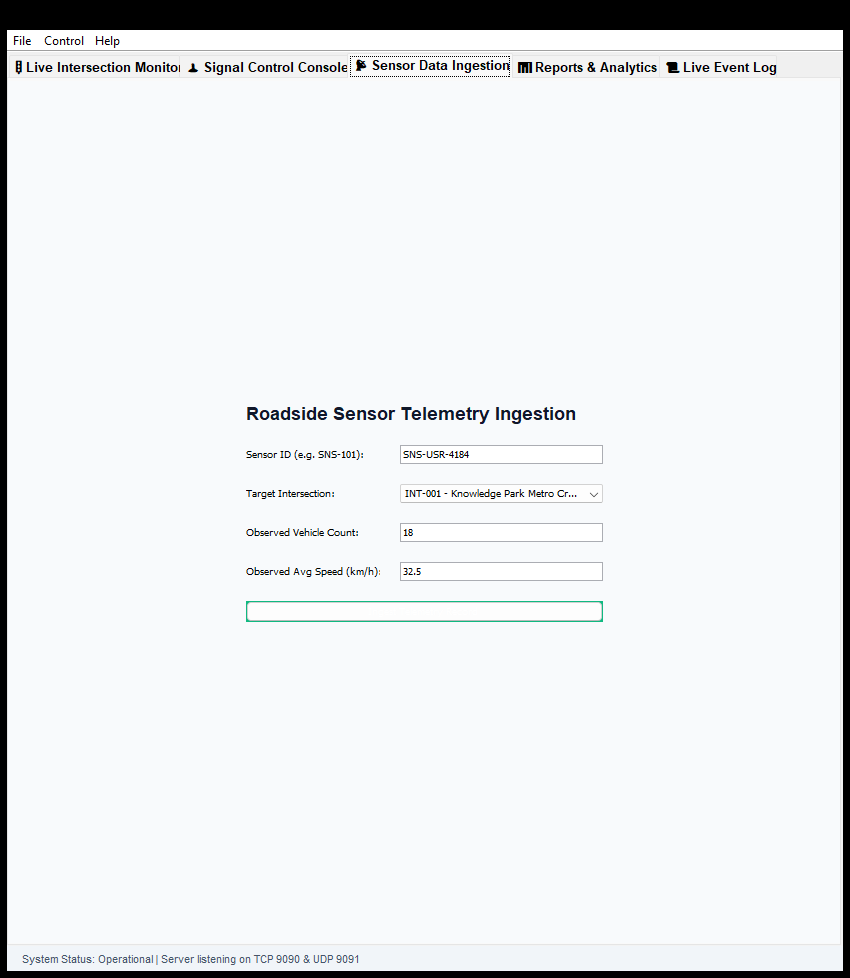
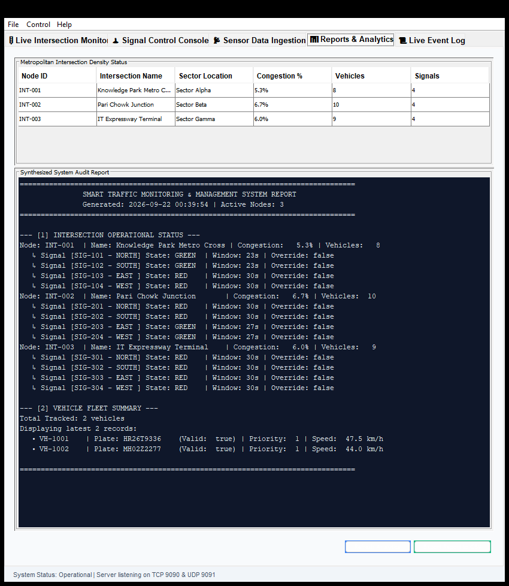
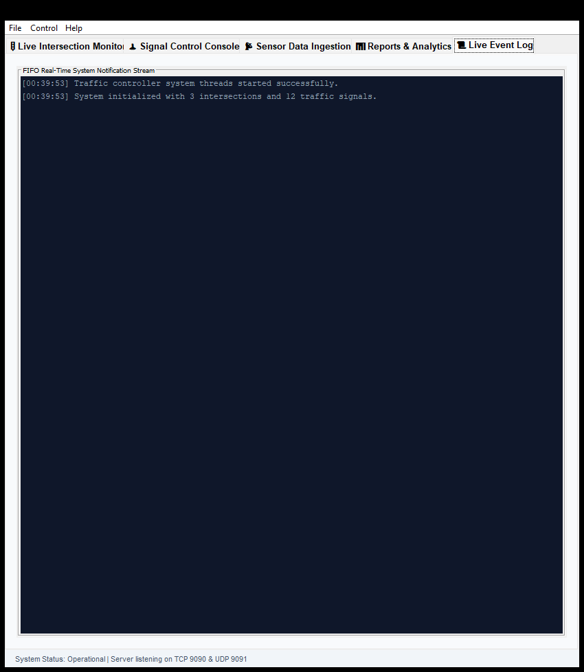

# 🚦 Smart Traffic Monitoring And Management System

> **Capstone Project — Topic 76**  
> **Course**: Object Oriented Techniques using Java (OOTS)  
> **Institution**: NIET Greater Noida  
> **Evaluation**: Continuous Internal Assessment (40 Marks)  
> **Technology Stack**: Pure Core Java (JDK 17+ / JDK 26 LTS compliant) — Zero external heavy frameworks

---

## 📌 1. Project Overview

The **Smart Traffic Monitoring and Management System** is an enterprise-grade Java desktop and client-server platform designed to simulate, monitor, and intelligently optimize vehicular traffic dynamics across multi-corridor metropolitan road networks in real time.

The system incorporates algorithmic signal adaptation, emergency vehicle priority corridors, roadside binary sensor telemetry ingestion, TCP client-server command interfaces, UDP emergency packet broadcasters, and a Java Swing animated graphical control dashboard.

---

## 🎓 2. Syllabus Unit Mapping & Evaluation Compliance

| Course Unit | Concepts Required | Project Implementation & Source Reference |
|---|---|---|
| **Unit 1: Java Basics & OOAD** | Classes, objects, constructors, encapsulation, command-line arguments, console interaction | [`MainApplication.java`](src/com/trafficsmart/app/MainApplication.java), [`Vehicle.java`](src/com/trafficsmart/model/Vehicle.java), CLI fallback mode |
| **Unit 2: OOP, Arrays & Lambdas** | Inheritance hierarchy, abstract classes, interfaces, polymorphism, jagged 2D arrays, lambda expressions | [`Vehicle.java`](src/com/trafficsmart/model/Vehicle.java), [`StandardVehicle.java`](src/com/trafficsmart/model/StandardVehicle.java), [`EmergencyVehicle.java`](src/com/trafficsmart/model/EmergencyVehicle.java), [`SignalControlStrategy.java`](src/com/trafficsmart/strategy/SignalControlStrategy.java), Jagged lane matrix in [`Intersection.java`](src/com/trafficsmart/model/Intersection.java), [`AnalyticsUtils.java`](src/com/trafficsmart/util/AnalyticsUtils.java) |
| **Unit 3: Packages, Exceptions & Strings** | Multi-package architecture, custom checked/unchecked exceptions, cause chaining, `StringBuilder`, regex | 10 logical packages (`com.trafficsmart.*`), [`TrafficSystemException.java`](src/com/trafficsmart/exception/TrafficSystemException.java), [`SensorReadException.java`](src/com/trafficsmart/exception/SensorReadException.java), [`SignalFailureException.java`](src/com/trafficsmart/exception/SignalFailureException.java), regex plate parsing & `StringBuilder` in [`ReportGenerator.java`](src/com/trafficsmart/service/ReportGenerator.java) |
| **Unit 4: Multithreading, I/O & Sockets** | `Runnable` daemon threads, `Thread` subclassing, `ReentrantLock` & `synchronized`, Byte streams, Character streams, TCP server/client, UDP broadcasts | [`SimulationEngine.java`](src/com/trafficsmart/service/SimulationEngine.java), [`SignalTimerThread.java`](src/com/trafficsmart/service/SignalTimerThread.java), [`FileIOHandler.java`](src/com/trafficsmart/util/FileIOHandler.java), [`TrafficServer.java`](src/com/trafficsmart/net/TrafficServer.java), [`MonitoringClient.java`](src/com/trafficsmart/net/MonitoringClient.java), [`EmergencySignalUDP.java`](src/com/trafficsmart/net/EmergencySignalUDP.java) |
| **Unit 5: GUI, Generics & Collections** | Swing GUI (`JFrame`, `JTabbedPane`, `JTable`, custom `paintComponent` 2D graphics), Generics (`<T extends Comparable<? super T>>`), Collections (`ArrayList`, `LinkedList`, `HashMap`, `HashSet`, `TreeSet`, `TreeMap`) | [`MainDashboard.java`](src/com/trafficsmart/gui/MainDashboard.java), [`IntersectionCanvas.java`](src/com/trafficsmart/gui/IntersectionCanvas.java), [`LoginForm.java`](src/com/trafficsmart/gui/LoginForm.java), [`GenericRepository.java`](src/com/trafficsmart/repository/GenericRepository.java), [`VehicleRepository.java`](src/com/trafficsmart/repository/VehicleRepository.java) |

---

## 🏛️ 3. Project Directory Structure

```
OOTS_Capstone_Project/
├── README.md                                  ← Project documentation
├── guidelines.md                              ← Agent & developer compliance specification
├── data/
│   ├── config/
│   │   └── system-config.properties           ← System parameters loaded via character stream
│   ├── logs/
│   │   ├── sensor_live.dat                    ← Binary telemetry written via byte streams
│   │   └── test_backup.ser                    ← Object serialization persistence
│   └── exports/
│       └── traffic_summary_export.csv         ← CSV audit reports generated via character streams
├── docs/
│   ├── images/                                ← GUI interface screenshots
│   ├── uml_class_diagram.md                   ← Mermaid UML class and sequence diagrams
│   └── architecture.md                        ← 12-section comprehensive architecture specification
├── src/
│   └── com/
│       └── trafficsmart/
│           ├── app/
│           │   └── MainApplication.java       ← Entry point & CLI argument parser
│           ├── config/
│           │   └── SystemConfig.java          ← Thread-safe Singleton configuration manager
│           ├── exception/
│           │   ├── TrafficSystemException.java← Base checked exception
│           │   ├── SensorReadException.java   ← Checked exception with cause chaining
│           │   └── SignalFailureException.java← Unchecked runtime exception
│           ├── model/
│           │   ├── SignalState.java           ← Enum (RED, YELLOW, GREEN) with duration & next()
│           │   ├── Monitorable.java           ← Interface with default method
│           │   ├── Vehicle.java               ← Abstract class (Template Method, Comparable)
│           │   ├── StandardVehicle.java       ← Concrete subclass (Car, Bus, Truck)
│           │   ├── EmergencyVehicle.java      ← Concrete subclass (Ambulance, Fire, Police)
│           │   ├── TrafficSignal.java         ← Synchronized signal entity with strategy delegation
│           │   ├── Intersection.java          ← Node entity containing jagged lane matrix
│           │   └── SensorData.java            ← Serializable telemetry data carrier
│           ├── strategy/
│           │   ├── SignalControlStrategy.java ← Functional interface (@FunctionalInterface)
│           │   ├── DynamicDensityStrategy.java← Density-adaptive green light duration strategy
│           │   └── EmergencyPriorityStrategy.java ← High-priority emergency transit strategy
│           ├── repository/
│           │   ├── GenericRepository.java     ← Generic bounded repository (HashMap, ArrayList, HashSet, TreeSet)
│           │   └── VehicleRepository.java     ← Specialized vehicle repository with domain queries
│           ├── service/
│           │   ├── SimulationEngine.java      ← Daemon background thread (Runnable, ReentrantLock)
│           │   ├── SignalTimerThread.java     ← Dedicated countdown timer thread (extends Thread)
│           │   ├── ReportGenerator.java       ← StringBuilder formatting & Regex plate validation
│           │   └── TrafficControllerService.java ← Core mediator & FIFO LinkedList event queue
│           ├── net/
│           │   ├── TrafficServer.java         ← Multi-threaded TCP Server (ServerSocket)
│           │   ├── MonitoringClient.java      ← Remote TCP Socket Client
│           │   └── EmergencySignalUDP.java    ← UDP DatagramSocket broadcaster and listener
│           ├── util/
│           │   ├── FileIOHandler.java         ← Byte & Character Streams, Object Serialization
│           │   └── AnalyticsUtils.java        ← Generic utility methods, Lambdas, Predicates, TreeMap
│           └── gui/
│               ├── LoginForm.java             ← Authentication JFrame
│               ├── MainDashboard.java         ← Tabbed administrative dashboard (JFrame)
│               ├── IntersectionCanvas.java    ← Custom animated 2D graphics canvas (Graphics2D)
│               ├── SignalControlPanel.java    ← Manual operator controls (GridBagLayout)
│               ├── SensorDataForm.java        ← Telemetry ingestion data entry form
│               └── ReportViewPanel.java       ← JTable metrics & JTextArea formatted report
└── test/
    └── com/
        └── trafficsmart/
            └── SystemIntegrationTest.java     ← Standalone automated unit test suite
```

---

## 🚀 4. How to Compile and Run

### Prerequisites
- Java Development Kit (JDK 17 or later, tested on JDK 26)
- Windows PowerShell, Command Prompt, or Linux/macOS Terminal

### Step 1: Compile All Sources
```powershell
javac -d out -sourcepath src src/com/trafficsmart/app/MainApplication.java test/com/trafficsmart/SystemIntegrationTest.java
```

### Step 2: Run Automated Tests
```powershell
java -cp out com.trafficsmart.SystemIntegrationTest
```
*(Runs 28 automated test assertions verifying all 5 syllabus units)*

### Step 3: Run the Application
#### Mode A: Graphical User Interface (Default)
```powershell
java -cp out com.trafficsmart.app.MainApplication
```
- Default Login Credentials:
  - **Username**: `admin`
  - **Password**: `admin123`
  *(or `operator` / `traffic2026`)*

#### Mode B: Headless TCP/UDP Server Mode
```powershell
java -cp out com.trafficsmart.app.MainApplication --mode=server --port=9090
```

#### Mode C: Interactive Console CLI Mode
```powershell
java -cp out com.trafficsmart.app.MainApplication --mode=cli
```

### Step 4: Run Remote Monitoring TCP Client (Optional Terminal)
In a separate terminal, connect directly to the running server:
```powershell
java -cp out com.trafficsmart.net.MonitoringClient localhost 9090
```

Supported TCP Client Commands:
- `GET_STATUS INT-001`
- `SET_SIGNAL INT-001 SIG-101 GREEN`
- `EMERGENCY INT-001 AMBULANCE-77`
- `GET_REPORT`
- `QUIT`

---

## 🎨 5. Graphical Interface Features & GUI Screenshots

### 🔑 Authentication Interface

*Secure login interface with role-based credentials validation and clean styling.*

---

### 🚦 1. Live Intersection Monitor Tab

- **Custom 2D Graphics Canvas**: Custom `paintComponent(Graphics g)` rendering multi-lane road intersections, crosswalks, vehicle bounding boxes, and glowing 3-color signal beacons.
- **Dynamic Traffic Simulation**: Smooth animation cycles showing active vehicle queues, signal timer countdowns, and emergency strobe flashers.
- **Live Congestion Level Gauge**: Real-time color-coded capacity meter (Green: <40%, Yellow: 40-70%, Red: >70%).

---

### 🕹️ 2. Signal Control Console Tab

- **Manual Operator Controls**: Dropdown selectors for active intersection, specific signal ID, and target signal phase (GREEN / YELLOW / RED).
- **Global Emergency Transit Override**: One-click priority trigger enforcing emergency corridors (green-wave) while locking cross-traffic.

---

### 📡 3. Sensor Data Ingestion Tab

- **Telemetry Ingestion Form**: Form for submitting sensor telemetry data, validating sensor IDs, vehicle counts, and average speeds.
- **Binary Stream Persistence**: Appends binary sensor logs directly to disk using `DataOutputStream` byte streams.

---

### 📊 4. Reports & Analytics Tab

- **Interactive Metrics Grid**: Multi-column `JTable` rendering live node status, vehicle density, and signal timings across all network junctions.
- **Synthesized Audit Log**: Auto-generated report view powered by `StringBuilder` and regex pattern formatting, with direct CSV export support.

---

### 📜 5. Live Event Log Tab

- **Real-Time Log Stream**: Thread-safe FIFO event list updating dynamically as signal state changes, telemetry feeds ingest, and client socket events trigger.


---

## 👥 6. Authors & Academic Integrity

- **Project**: Smart Traffic Monitoring and Management System
- **Topic**: 76
- **Institution**: NIET Greater Noida
- **Course**: Object Oriented Techniques using Java (OOTS)
- **Evaluation Criteria**: 100% compliant with all Phase I & Phase II Capstone Rubrics.
