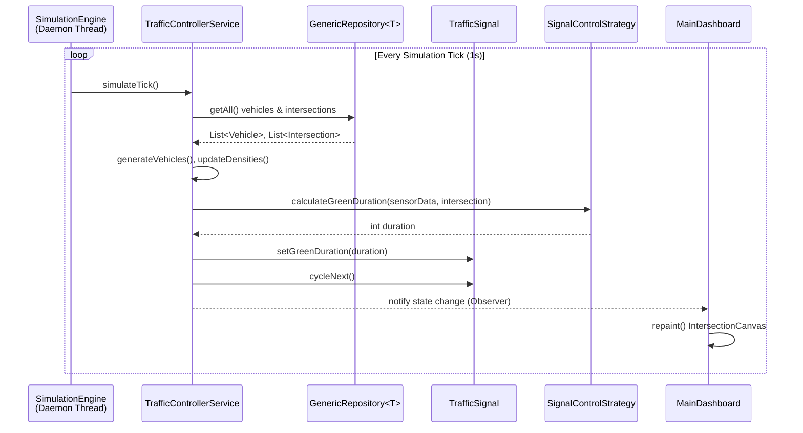
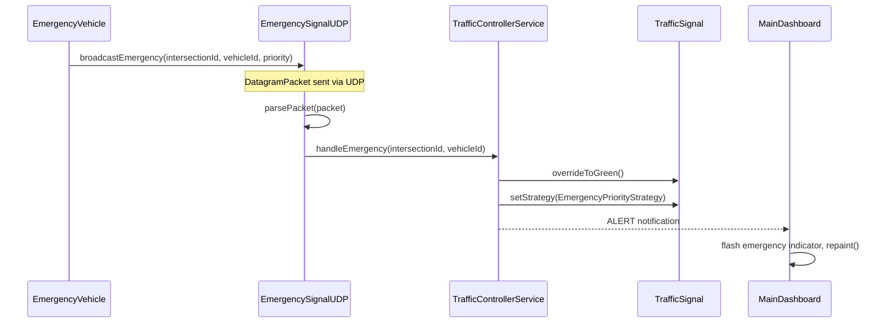
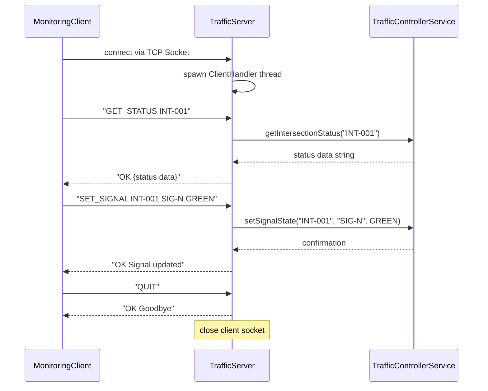
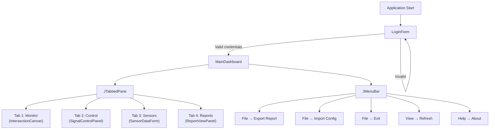

# System Architecture — Smart Traffic Monitoring And Management System

> **Version**: 1.0
> **Topic**: 76
> **Last Updated**: 2026-09-21

---

## Table of Contents

1. [System Overview](#1-system-overview)
2. [Architectural Style](#2-architectural-style)
3. [Package Architecture](#3-package-architecture)
4. [Data Flow](#4-data-flow)
5. [Threading Model](#5-threading-model)
6. [Networking Architecture](#6-networking-architecture)
7. [I/O & Persistence Architecture](#7-io--persistence-architecture)
8. [GUI Architecture](#8-gui-architecture)
9. [Exception Handling Strategy](#9-exception-handling-strategy)
10. [Design Patterns Applied](#10-design-patterns-applied)
11. [Generics & Collections Map](#11-generics--collections-map)
12. [Deployment Topology](#12-deployment-topology)

---

## 1. System Overview

The Smart Traffic Monitoring And Management System is a multi-threaded, networked Java desktop application that simulates, monitors, and manages traffic flow across a network of intersections in real time.

### Key Capabilities

| Capability | Description |
|---|---|
| **Real-Time Simulation** | Background daemon threads simulate vehicles arriving/departing intersections at configurable densities |
| **Adaptive Signal Control** | Traffic signal green-phase durations dynamically adjust based on sensor-reported vehicle density using the Strategy pattern |
| **Emergency Override** | Emergency vehicles broadcast UDP packets that trigger immediate green-phase on their approach lane |
| **Live GUI Dashboard** | Animated Swing dashboard with custom `Graphics2D` rendering of traffic lights, vehicle queues, and congestion heat maps |
| **Remote Monitoring** | TCP client-server architecture allowing remote query and manual signal override |
| **Data Persistence** | Binary sensor logs (byte streams), text reports/CSV (character streams), `.properties` configuration |
| **Analytics & Reporting** | Formatted traffic reports using `StringBuilder`, `String.format()`, and regex-validated data |

---

## 2. Architectural Style

The system follows a **Layered Architecture** with clear unidirectional dependencies flowing downward:

```
┌─────────────────────────────────────────────────────┐
│                  PRESENTATION LAYER                 │
│         (gui/ — Swing JFrame, JPanel, Canvas)       │
├─────────────────────────────────────────────────────┤
│                  NETWORK LAYER                      │
│    (net/ — TCP Server, TCP Client, UDP Handler)     │
├─────────────────────────────────────────────────────┤
│                  SERVICE LAYER                      │
│   (service/ — Controller, Simulation, Reporting)    │
├─────────────────────────────────────────────────────┤
│                REPOSITORY LAYER                     │
│   (repository/ — GenericRepository<T>, VehicleRepo) │
├─────────────────────────────────────────────────────┤
│                 STRATEGY LAYER                      │
│     (strategy/ — Signal control algorithms)         │
├─────────────────────────────────────────────────────┤
│                  MODEL LAYER                        │
│  (model/ — Vehicle, Signal, Intersection, Sensor)   │
├─────────────────────────────────────────────────────┤
│               CROSS-CUTTING CONCERNS                │
│   (exception/, util/, config/)                      │
└─────────────────────────────────────────────────────┘
```

### Dependency Rules

- **GUI → Service**: The GUI layer calls `TrafficControllerService` methods. It never directly accesses repositories or models for mutation.
- **Network → Service**: `TrafficServer` and `EmergencySignalUDP` delegate all logic to `TrafficControllerService`.
- **Service → Repository**: Services use `GenericRepository<T>` for data storage and retrieval.
- **Service → Strategy**: `TrafficControllerService` assigns strategy implementations to `TrafficSignal` objects.
- **Repository → Model**: Repositories store and retrieve model entities.
- **Cross-cutting**: `exception/`, `util/`, and `config/` packages are used by all layers.

---

## 3. Package Architecture

```
com.trafficsmart
├── app          → Application entry point, CLI argument parsing
├── config       → SystemConfig singleton, constants, defaults
├── exception    → Custom exception hierarchy (checked + unchecked)
├── model        → Domain entities, enums, abstract classes
├── strategy     → Strategy pattern: signal control algorithms
├── repository   → Generic data store with type-safe CRUD
├── service      → Business logic, simulation engine, report generation
├── net          → TCP server/client, UDP emergency handler
├── util         → File I/O (byte + char streams), analytics lambdas
└── gui          → Swing UI components, custom canvas, forms
```

### Package Responsibilities

| Package | Responsibility | Key Classes | Syllabus Coverage |
|---|---|---|---|
| `app` | Bootstrap, CLI mode switching, `main()` | `MainApplication` | Unit 1 |
| `config` | Centralized configuration singleton | `SystemConfig` | Unit 3 (packages), Design Patterns |
| `exception` | Custom checked/unchecked exceptions with cause chaining | `TrafficSystemException`, `SignalFailureException`, `SensorReadException` | Unit 3 |
| `model` | Domain entities, abstract classes, enums, interfaces | `Vehicle` (abstract), `StandardVehicle`, `EmergencyVehicle`, `TrafficSignal`, `Intersection`, `SensorData`, `SignalState`, `Monitorable` | Units 1, 2 |
| `strategy` | Pluggable signal control algorithms | `SignalControlStrategy` (functional interface), `DynamicDensityStrategy`, `EmergencyPriorityStrategy` | Unit 2 (interfaces, lambdas) |
| `repository` | Type-safe generic data storage | `GenericRepository<T>`, `VehicleRepository` | Unit 5 (generics, collections) |
| `service` | Core business logic, threading, reporting | `TrafficControllerService`, `SimulationEngine`, `ReportGenerator` | Units 2, 3, 4 |
| `net` | Socket networking (TCP + UDP) | `TrafficServer`, `MonitoringClient`, `EmergencySignalUDP` | Unit 4 |
| `util` | File I/O operations, lambda-based analytics | `FileIOHandler`, `AnalyticsUtils` | Units 3, 4, 2 |
| `gui` | Swing desktop interface | `LoginForm`, `MainDashboard`, `IntersectionCanvas`, `SignalControlPanel`, `SensorDataForm`, `ReportViewPanel` | Unit 5 |

---

## 4. Data Flow

### 4.1 Normal Operation Flow



### 4.2 Emergency Override Flow



### 4.3 Remote Monitoring Flow



---

## 5. Threading Model

### 5.1 Thread Inventory

| Thread | Type | Daemon? | Purpose | Synchronization |
|---|---|---|---|---|
| **Main Thread** | JVM main | No | Application bootstrap, GUI launch via `SwingUtilities.invokeLater()` | — |
| **EDT (Event Dispatch Thread)** | Swing managed | No | All GUI operations (painting, event handling) | Swing thread-safety rules |
| **SimulationEngine** | `implements Runnable` | **Yes** (daemon) | Background traffic flow simulation ticking every 1 second | `ReentrantLock` on intersection state |
| **SignalTimerThread** | `extends Thread` | No | Per-signal phase timer, cycles RED→GREEN→YELLOW→RED | `synchronized` methods on `TrafficSignal` |
| **TrafficServer** | `implements Runnable` | No | TCP `ServerSocket.accept()` loop, spawns client handlers | `volatile boolean running` |
| **ClientHandler** | `implements Runnable` | No | One per connected TCP client, reads commands, writes responses | Thread-safe access to `TrafficControllerService` |
| **EmergencySignalUDP** | `implements Runnable` | No | UDP `DatagramSocket.receive()` loop, listens for emergency broadcasts | `synchronized` on emergency handler |

### 5.2 Synchronization Strategy

```
┌──────────────────────────────────────────────────┐
│           SHARED MUTABLE STATE                   │
├──────────────────────────────────────────────────┤
│                                                  │
│  Intersection state (signals, density, vehicles) │
│  ├── Protected by: ReentrantLock                 │
│  ├── Writers: SimulationEngine, ClientHandler,   │
│  │            EmergencySignalUDP                 │
│  └── Readers: GUI (via EDT), MonitoringClient    │
│                                                  │
│  TrafficSignal.currentState                      │
│  ├── Protected by: synchronized methods          │
│  └── Writers: SignalTimerThread, EmergencyHandler │
│                                                  │
│  Control flags (running, active)                 │
│  ├── Protected by: volatile keyword              │
│  └── Readers: Thread.run() loop conditions       │
│                                                  │
│  Event queue (LinkedList<String>)                │
│  ├── Protected by: synchronized block            │
│  └── Writers: any service, Readers: GUI/Reporter │
│                                                  │
└──────────────────────────────────────────────────┘
```

### 5.3 Thread Lifecycle Management

```java
// Daemon thread example (SimulationEngine)
Thread simThread = new Thread(simulationEngine, "SimulationEngine");
simThread.setDaemon(true);  // JVM exits even if this is running
simThread.start();

// Graceful shutdown
simulationEngine.stop();     // sets volatile running = false
simThread.join(5000);        // wait up to 5 seconds

// SignalTimerThread lifecycle
SignalTimerThread timer = new SignalTimerThread(signal);
timer.start();
// ... later ...
timer.deactivate();          // sets volatile active = false
timer.interrupt();           // breaks out of sleep
timer.join();
```

---

## 6. Networking Architecture

### 6.1 TCP Architecture (Remote Monitoring)

```
┌─────────────────┐         TCP (port 9090)         ┌──────────────────┐
│ MonitoringClient │◄──────────────────────────────►│  TrafficServer    │
│                  │    Socket / ServerSocket        │                  │
│  - BufferedReader│    Text-based protocol          │  - ServerSocket  │
│  - PrintWriter   │    Newline-delimited            │  - Thread pool   │
└─────────────────┘                                  └────────┬─────────┘
                                                              │
                                                              ▼
                                                    TrafficControllerService
```

### 6.2 UDP Architecture (Emergency Broadcast)

```
┌─────────────────┐      UDP (port 9091)      ┌──────────────────────┐
│ Emergency Source │────────────────────────────►│  EmergencySignalUDP │
│ (broadcast)      │   DatagramPacket           │                     │
│                  │   "EMERGENCY:INT-001:      │  - DatagramSocket   │
│                  │    VH-E001:1"              │  - parsePacket()    │
└─────────────────┘                             └─────────┬───────────┘
                                                          │
                                                          ▼
                                                TrafficControllerService
                                                   .handleEmergency()
```

### 6.3 Protocol Specification

#### TCP Commands (Client → Server)

| Command | Format | Description |
|---|---|---|
| `GET_STATUS` | `GET_STATUS <intersection_id>` | Query intersection state |
| `SET_SIGNAL` | `SET_SIGNAL <intersection_id> <signal_id> <RED\|YELLOW\|GREEN>` | Manual signal override |
| `GET_REPORT` | `GET_REPORT` | Request full traffic analytics report |
| `EMERGENCY` | `EMERGENCY <intersection_id> <vehicle_id>` | Trigger emergency override |
| `QUIT` | `QUIT` | Disconnect from server |

#### TCP Responses (Server → Client)

| Response | Format | Description |
|---|---|---|
| `OK` | `OK <data>` | Successful command execution with optional data |
| `ERROR` | `ERROR <message>` | Command failed with reason |
| `ALERT` | `ALERT <message>` | Unsolicited server notification (emergency, congestion) |

#### UDP Packet Format

```
Payload: "EMERGENCY:<intersection_id>:<vehicle_id>:<priority>"
Example: "EMERGENCY:INT-001:VH-E001:1"
```

---

## 7. I/O & Persistence Architecture

### 7.1 Stream Usage Map

| Purpose | Stream Type | Class Used | File Format |
|---|---|---|---|
| Sensor binary logs | **Byte Output** | `DataOutputStream` → `FileOutputStream` | `.dat` |
| Read sensor binary logs | **Byte Input** | `DataInputStream` → `FileInputStream` | `.dat` |
| Export traffic reports | **Character Output** | `PrintWriter` → `BufferedWriter` → `FileWriter` | `.csv`, `.txt` |
| Read configuration | **Character Input** | `BufferedReader` → `FileReader` | `.properties`, `.csv` |
| Object persistence (backup) | **Byte (Serialization)** | `ObjectOutputStream` / `ObjectInputStream` | `.ser` |

### 7.2 File System Layout

```
data/
├── config/
│   └── system-config.properties     ← Character stream read (BufferedReader)
│       # server.port=9090
│       # udp.port=9091
│       # simulation.tick.ms=1000
│       # signal.default.green.duration=30
│       # signal.min.green=10
│       # signal.max.green=60
│
├── logs/
│   ├── sensor_log_2026.dat          ← Byte stream write (DataOutputStream)
│   │   Binary format per record:
│   │   [UTF sensorId][UTF intersectionId][int vehicleCount][double avgSpeed][long timestamp]
│   │
│   └── traffic_events.log           ← Character stream append (PrintWriter)
│       [2026-09-21 14:30:00] [INFO] Signal SIG-N at INT-001 changed to GREEN
│
└── exports/
    ├── traffic_report_2026-09-21.csv ← Character stream write (PrintWriter)
    │   intersection_id,signal_id,state,green_duration,congestion_level
    │
    └── sensor_backup_2026-09-21.ser  ← Object serialization (ObjectOutputStream)
```

### 7.3 FileIOHandler Responsibilities

```java
public class FileIOHandler {
    // Byte Streams
    public static void writeSensorDataBinary(SensorData data, String filePath)
        throws SensorReadException { ... }
    public static SensorData readSensorDataBinary(String filePath)
        throws SensorReadException { ... }

    // Character Streams
    public static void writeReportCsv(List<String[]> rows, String filePath)
        throws TrafficSystemException { ... }
    public static List<String[]> readCsv(String filePath)
        throws TrafficSystemException { ... }
    public static Properties loadConfig(String filePath)
        throws TrafficSystemException { ... }

    // Serialization
    public static void serializeObject(Serializable obj, String filePath)
        throws TrafficSystemException { ... }
    public static <T> T deserializeObject(String filePath, Class<T> type)
        throws TrafficSystemException { ... }
}
```

---

## 8. GUI Architecture

### 8.1 Window Flow



### 8.2 Component Details

| Component | Swing Base | Key Features |
|---|---|---|
| `LoginForm` | `JFrame` | `JTextField` (username), `JPasswordField` (password), `JButton` (login), credential validation |
| `MainDashboard` | `JFrame` | `JTabbedPane` with 4 tabs, `JMenuBar` with File/View/Help menus, `BorderLayout` |
| `IntersectionCanvas` | `JPanel` | Custom `paintComponent(Graphics g)` with `Graphics2D`, `javax.swing.Timer` for 500ms animation ticks, draws traffic lights (colored circles), vehicle queue bars, congestion heat gradient |
| `SignalControlPanel` | `JPanel` | `JComboBox` (intersection selector), `JComboBox` (signal selector), `JButton` (override), `GridBagLayout` |
| `SensorDataForm` | `JPanel` | `JTextField` ×4 (sensor fields), `JButton` (submit), input validation with `JOptionPane` alerts |
| `ReportViewPanel` | `JPanel` | `JTable` (tabular report data), `JTextArea` (formatted text report), `JButton` (generate/export), `BorderLayout` |

### 8.3 Custom Canvas Rendering

The `IntersectionCanvas` is the visual centerpiece, rendering:

```
┌──────────────────────────────────────────────────┐
│                                                  │
│     ┌───┐                        ┌───┐           │
│     │ ● │ RED                    │   │           │
│     │   │                        │ ● │ GREEN     │
│     │   │                        │   │           │
│     └───┘                        └───┘           │
│      SIG-N                        SIG-E          │
│                                                  │
│  ▓▓▓▓▓▓▓ (12 vehicles)    ▓▓▓ (5 vehicles)      │
│                                                  │
│     ┌───┐                        ┌───┐           │
│     │   │                        │   │           │
│     │ ● │ YELLOW                 │ ● │ RED       │
│     │   │                        │   │           │
│     └───┘                        └───┘           │
│      SIG-S                        SIG-W          │
│                                                  │
│  Congestion: ████████░░ 78%                      │
│                                                  │
│  [INT-001: Main St & 5th Ave]                    │
└──────────────────────────────────────────────────┘
```

Rendered using:
- `Graphics2D.fillOval()` for traffic light circles
- `Graphics2D.fillRect()` for vehicle queue bars
- `Graphics2D.fillRoundRect()` for congestion gauge
- `Graphics2D.setColor()` cycling through `Color.RED`, `Color.YELLOW`, `Color.GREEN`
- `Graphics2D.drawString()` for labels
- `javax.swing.Timer` at 500ms for smooth animation

---

## 9. Exception Handling Strategy

### 9.1 Exception Hierarchy

```
java.lang.Exception
└── TrafficSystemException (checked)
    └── SensorReadException (checked, wraps IOException)

java.lang.RuntimeException
└── SignalFailureException (unchecked)
```

### 9.2 Exception Usage Guidelines

| Exception | When to Throw | Handling Strategy |
|---|---|---|
| `TrafficSystemException` | Configuration errors, data format errors, general recoverable failures | Catch at service layer, log, show user-friendly message in GUI |
| `SensorReadException` | I/O failure reading sensor data (binary or character stream) | Catch at I/O layer, wrap `IOException` with cause chaining, propagate to service |
| `SignalFailureException` | Invalid signal state transition, null signal reference | Let propagate as unchecked, catch at top-level for logging |

### 9.3 Exception Patterns Required

```java
// 1. try-with-resources (MANDATORY for all I/O)
try (BufferedReader reader = new BufferedReader(new FileReader(path))) {
    // ...
}

// 2. Multi-catch
try {
    // ...
} catch (IOException | NumberFormatException e) {
    throw new TrafficSystemException("Data parse error", e);
}

// 3. Cause chaining
try {
    readBinaryData(path);
} catch (IOException e) {
    throw new SensorReadException("Failed to read sensor " + sensorId, sensorId, e);
}

// 4. try-catch-finally (for non-AutoCloseable cleanup)
Lock lock = new ReentrantLock();
lock.lock();
try {
    // critical section
} finally {
    lock.unlock();
}
```

---

## 10. Design Patterns Applied

| Pattern | Implementation | Purpose |
|---|---|---|
| **Strategy** | `SignalControlStrategy` interface with `DynamicDensityStrategy` and `EmergencyPriorityStrategy` | Swap signal timing algorithms at runtime |
| **Singleton** | `SystemConfig` with private constructor + `getInstance()` | Single source of configuration across the application |
| **Repository** | `GenericRepository<T>` with generic CRUD operations | Abstract data persistence from business logic |
| **Observer** (lightweight) | `TrafficControllerService` notifies GUI of state changes via callbacks | Decouple model from view layer |
| **Template Method** | `Vehicle.describe()` calls abstract `getVehicleCategory()` | Uniform description format with subclass-specific content |
| **Command** (implicit) | TCP text protocol (`GET_STATUS`, `SET_SIGNAL`, etc.) | Structured client-server communication |

---

## 11. Generics & Collections Map

### 11.1 Generics Usage

| Generic Element | Declaration | Usage |
|---|---|---|
| `GenericRepository<T>` | `public class GenericRepository<T>` | Stores any entity type with String-keyed CRUD |
| Bounded type | `<T extends Comparable<T>>` | `findSorted()` method returning `TreeSet<T>` |
| Generic method | `<T> List<T> filterBy(List<T> items, Predicate<T> predicate)` | In `AnalyticsUtils` for lambda-based filtering |
| Wildcard | `List<? extends Vehicle>` | Method parameter accepting any Vehicle subtype |

### 11.2 Collections Usage Map

| Collection | Location | Purpose |
|---|---|---|
| `ArrayList<Vehicle>` | `GenericRepository`, `VehicleRepository` | Ordered vehicle storage |
| `LinkedList<String>` | `TrafficControllerService` | Event notification queue (FIFO) |
| `HashMap<String, T>` | `GenericRepository` | O(1) entity lookup by ID |
| `HashSet<String>` | `GenericRepository` | Unique ID tracking, deduplication |
| `TreeSet<T>` | `GenericRepository.findSorted()` | Sorted entity retrieval (congestion ranking) |
| `TreeMap<Double, Intersection>` | `AnalyticsUtils` | Congestion-sorted intersection map |

---

## 12. Deployment Topology

### Single Machine (Development / Demo)

```
┌────────────────────────────────────────────────────────┐
│                    JVM Instance 1                      │
│                                                        │
│  ┌──────────┐  ┌─────────────────┐  ┌──────────────┐  │
│  │ GUI      │  │ TrafficServer   │  │ Emergency    │  │
│  │ (Swing)  │  │ (TCP :9090)     │  │ UDP (:9091)  │  │
│  │          │  │                 │  │              │  │
│  └────┬─────┘  └────────┬────────┘  └──────┬───────┘  │
│       │                 │                   │          │
│       └────────┬────────┘                   │          │
│                ▼                            │          │
│      TrafficControllerService ◄─────────────┘          │
│                │                                       │
│       ┌────────┴────────┐                              │
│       ▼                 ▼                              │
│  SimulationEngine   Repositories                       │
│  (daemon thread)    (in-memory)                        │
│                                                        │
└────────────────────────────────────────────────────────┘

┌────────────────────────────────────────────────────────┐
│                    JVM Instance 2 (Optional)           │
│                                                        │
│  ┌─────────────────────────────────────────┐           │
│  │ MonitoringClient                        │           │
│  │ java com.trafficsmart.net.MonitoringClient│          │
│  │       localhost 9090                     │           │
│  └─────────────────────────────────────────┘           │
│                                                        │
└────────────────────────────────────────────────────────┘
```

### Build & Run

```bash
# From project root: OOTS_Capstone_Project/

# 1. Compile
javac -d out -sourcepath src src/com/trafficsmart/app/MainApplication.java

# 2. Run Server + GUI (default mode)
java -cp out com.trafficsmart.app.MainApplication

# 3. Run Server only (CLI mode)
java -cp out com.trafficsmart.app.MainApplication --mode=server --port=9090

# 4. Run Remote Client (separate terminal)
java -cp out com.trafficsmart.net.MonitoringClient localhost 9090
```

---

*For UML class diagrams, see [uml_class_diagram.md](./uml_class_diagram.md).*
*For coding standards and compliance checklist, see [../guidelines.md](../guidelines.md).*
