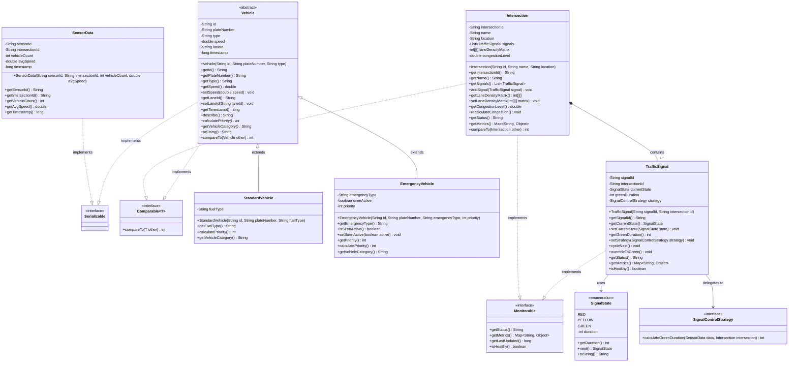
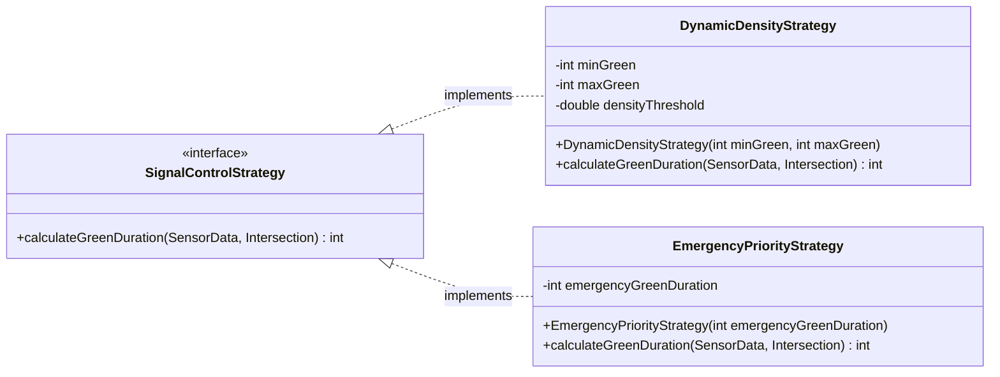
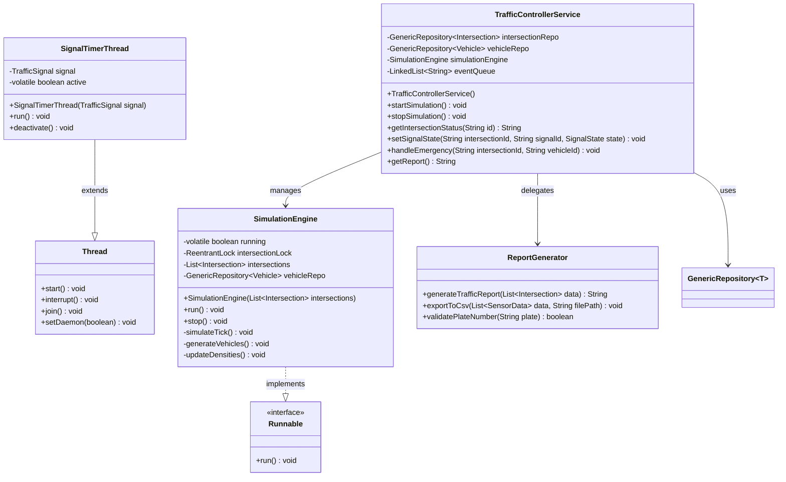
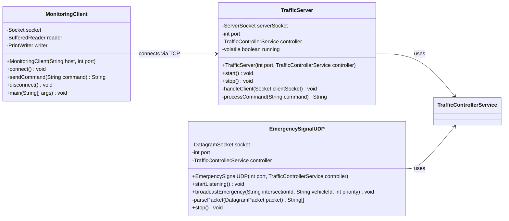
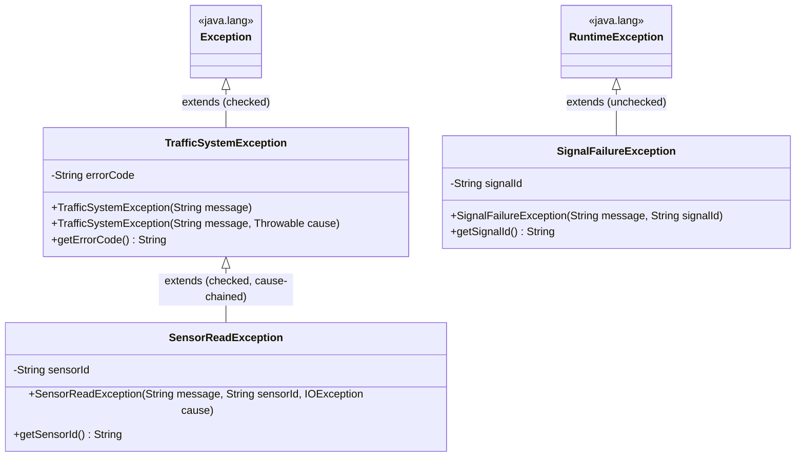
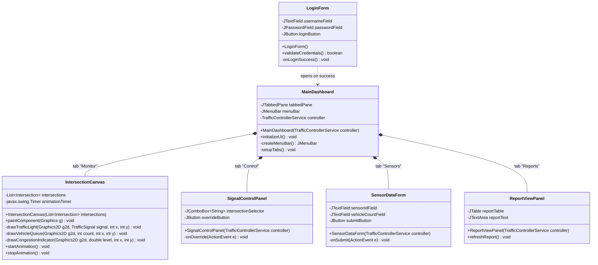
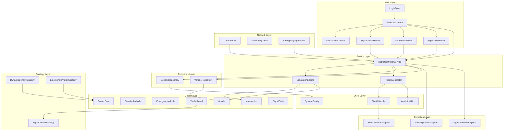

# UML Class Diagram — Smart Traffic Monitoring And Management System

> Auto-generated from project guidelines. Covers all domain entities, interfaces, strategies, repositories, services, networking, and GUI components.

---

## Core Domain Model



---

## Strategy Pattern



---

## Generics & Repository Layer

```mermaid
classDiagram
    direction TB

    class GenericRepository~T~ {
        -HashMap~String, T~ store
        -ArrayList~T~ orderedList
        -HashSet~String~ idSet
        +add(String id, T entity) void
        +getById(String id) T
        +getAll() List~T~
        +remove(String id) boolean
        +exists(String id) boolean
        +count() int
        +clear() void
        +filterBy(Predicate~T~ predicate) List~T~
        +getSorted(Comparator~T~ comparator) List~T~
        +findSorted() TreeSet~T~
    }

    class VehicleRepository {
        +VehicleRepository()
        +findByPlate(String plate) Vehicle
        +findEmergencyVehicles() List~EmergencyVehicle~
        +getSpeedSorted() List~Vehicle~
    }

    GenericRepository~T~ <|-- VehicleRepository : extends
    GenericRepository~T~ --> "HashMap" : uses
    GenericRepository~T~ --> "ArrayList" : uses
    GenericRepository~T~ --> "HashSet" : uses
    GenericRepository~T~ --> "TreeSet" : uses
```

---

## Service & Threading Layer



---

## Networking Layer



---

## Exception Hierarchy



---

## GUI Component Tree



---

## Full System Dependency Graph



---

*Diagram rendered using Mermaid. View in any Mermaid-compatible markdown renderer.*
